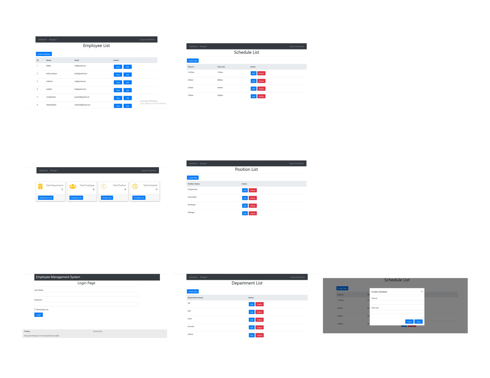

# Project Name
> ## Employee Management System using Asp.Net Core and Microsoft Sql Server.

# Table of contents
* [General info](#general-info)
* [Screenshots](#screenshots)
* [Technologies](#technologies)
* [Setup](#setup)

# General info
The Key Feature are:
* ### An Employer can  manage their employee information and their working status.
* ### Employer can create and update the employee information.
* ### He or she can create and update Department and Position for each Department.
* ### He or she can track the employee in each Department.
* ### He or she can create the time schedule for each Employee.

# Screenshots

# Technologies
* ### Asp.Net Core
* ### Microsoft Sql Server for Database
* ### Bootstrap 4
* ### Html, CSS, jQuery

# Setup
**Download the project. Then place the backpack file to your Sql Server Management System.Open the Employee Management and place your connection string into the project. Then Migration your project and update database. Then run it to your browser and enjoy the Project.**
